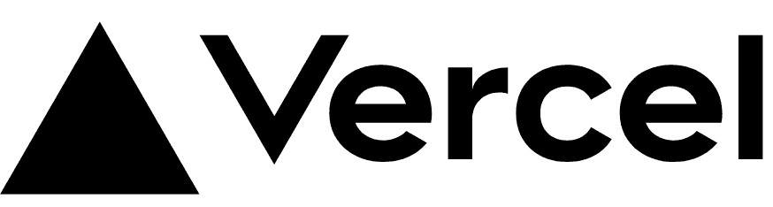
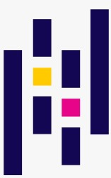
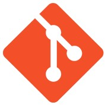
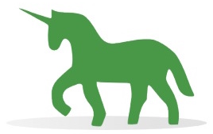
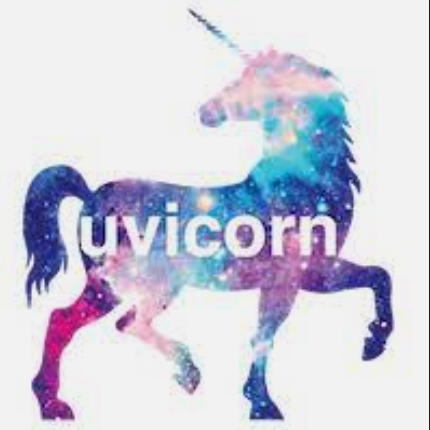

<!--
**katrina-l-hill/katrina-l-hill** is a ✨ _special_ ✨ repository because its `README.md` (this file) appears on your GitHub profile.

Here are some ideas to get you started:

- 🔭 I’m currently working on ...
- 🌱 I’m currently learning ...
- 👯 I’m looking to collaborate on ...
- 🤔 I’m looking for help with ...
- 💬 Ask me about ...
- 📫 How to reach me: ...
- 😄 Pronouns: ...
- ⚡ Fun fact: ...
-->

# Hello! 👋 My name's Katrina Hill. Welcome to my page :blush:

I'm a Full-Stack Software Developer and Navy Veteran with a background in government regulatory compliance management. Highly accomplished, solutions-focused professional with exceptional management skills in project and human resources. Seeking an opportunity to utilize my coding skills in the creation of meaningful software applications.

## Programming Languages

|  |  |  |  |  |
| ----------- | ----------- | ----------- | ----------- | ----------- |
 |  | |  |  |
|  |  |  |  |

## Projects

___
- "Iro Iro" - Image Processing & Colorization
  - Used a computer vision/machine learning driven image colorization tool to process and manipulate images.
  - [Front-end Repo](https://github.com/North-Pac/hurricane-photo-frontend)
  - [Back-end Repo](https://github.com/North-Pac/ben-backend-test)
  - [Colorizer Repo](https://github.com/North-Pac/hurricane-colorizer)
- "PyGirl" - Python Guessing Game
  - Developed a Python learning tool based on the “Hangman” guessing game that allows users to guess Python specific terminology.
  - [Front-end Repo](https://github.com/PieThonistas/pygirl_frontend)
  - [Back-end Repo](https://github.com/PieThonistas/PyGirl)
- "Where in the World" - Travel and Adventure Application
  - Developed a MERN application that validates user credentials for third-party authorization through Auth0 built as a travel website.
  - [Front-end Repo](https://github.com/Sawa-Sawa-CF/where-in-the-world-frontend)
  - [Back-end Repo](https://github.com/Sawa-Sawa-CF/where-in-the-world-backend)
  
 

## Software Tools

| | | |
| ----------- | ----------- | ----------- |
|  MongoDB |  Express.js |  React 
|  Next.js |  Node.js |  Django 
|  Docker |  OAuth |  Auth0 | 
| Axios | FastAPI |  OpenCV | 
| Chakra UI |  Vercel |  ElephantSQL 
|  PostgreSQL |  SQLite |  AWS S3 
|  Jira |  Matplotlib |  Kaggle 
|  NumPy |  Pandas |  Scikit-learn 
|  PyScript |  Pytest |  Postman 
|  Thunder Client |  jQuery |  Ajax 
|  Git |  GitHub |  Gunicorn 
|  Uvicorn |  Heroku |  Netlify 
|  Trello |  VS Code |  Linux | 
| | | |

 

## Education

___

- Candidate for PCAPTM – Certified Associate in Python Programming Certification – IVMF Syracuse University                     Expected Completion  May 2023
- Advanced Software Development with Python – Code Fellows, Seattle, WA
- Master of Science: Natural Resource Policy & Administration – University of Florida, Gainesville, FL
- Bachelor of Science: Environmental Sciences, Policy, and Management – University of Minnesota, Minneapolis, MN

 

## I'd love to connect with you

___
&nbsp;  &nbsp;&nbsp; [LinkedIn](https://www.linkedin.com/in/katrina-l-hill/)

&nbsp;  &nbsp;&nbsp; [katrina.lenell.hill@gmail.com](katrina.lenell.hill@gmail.com)
