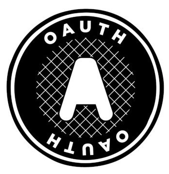

<!--
**katrina-l-hill/katrina-l-hill** is a ✨ _special_ ✨ repository because its `README.md` (this file) appears on your GitHub profile.

Here are some ideas to get you started:

- 🔭 I’m currently working on ...
- 🌱 I’m currently learning ...
- 👯 I’m looking to collaborate on ...
- 🤔 I’m looking for help with ...
- 💬 Ask me about ...
- 📫 How to reach me: ...
- 😄 Pronouns: ...
- ⚡ Fun fact: ...
-->

### Hello! 👋 My name's Katrina Hill. Welcome to my page :blush:

I'm a Full-Stack Software Developer with a background in environmental compliance, enforcement, and management. I’m also a Navy veteran with five years’ experience as an IT Network Administrator. I'm still passionate about environmental science and want to combine my experience in that field with my new software development career. I feel that the skills I've learned from both careers will allow me to positively contribute to an organization’s mission and values.

## Languages

|  |  |  |  |
| ----------- | ----------- | ----------- | ----------- |
 |  |  |  |
|  |  |  |  |

## Projects

___
- Iro Iro
  - Used a computer vision/machine learning driven image colorization tool to process and manipulate images.
  - [Front-end Repo](https://github.com/North-Pac/hurricane-photo-frontend)
  - [Back-end Repo](https://github.com/North-Pac/ben-backend-test)
  - [Colorizer Repo](https://github.com/North-Pac/hurricane-colorizer)
- PyGirl
  - Developed a Python learning tool based on the “Hangman” guessing game that allows users to guess Python specific terminology.
  - [Front-end Repo](https://github.com/PieThonistas/pygirl_frontend)
  - [Back-end Repo](https://github.com/PieThonistas/PyGirl)
- Where in the World
  - Developed a MERN application that validates user credentials for third-party authorization through Auth0.
  - [Front-end Repo](https://github.com/Sawa-Sawa-CF/where-in-the-world-frontend)
  - [Back-end Repo](https://github.com/Sawa-Sawa-CF/where-in-the-world-backend)
- PetsRUs
  - Created a pet adoption website designed to solve the problem of overcrowding in pet shelters. Added local storage and a constructor to pull out user input for pet selection into a shopping cart.
  - [Repo](https://github.com/PetsRus/PetsRUs)
- [Python Data Structures and Algorithms](https://github.com/katrina-l-hill/data-structures-and-algorithms)
___
  
 

## Tools

| | | |
| ----------- | ----------- | ----------- |
|  MongoDB |  Express.js |  React |  Next.js |
|  Node.js |  Django |  Django REST Framework |
|  Docker |  OAuth |  Auth0 |
| NextJS | FastAPI |  OpenCV |
| Chakra UI |  Vercel |  ElephantSQL | 
| Vercel |  SQLite |  AWS S3 | 
| Jira |  Matplotlib |  Kaggle | 
| NumPy |  Pandas |  Scikit-learn | 
| PyScript |  Pytest |  Postman | 
| Thunder Client |  jQuery |  Ajax | 
| Git |  GitHub |  Gunicorn | 
| Uvicorn |  Heroku |  Netlify | 
| Trello |  VS Code |  Linux | 
| | | |

 
